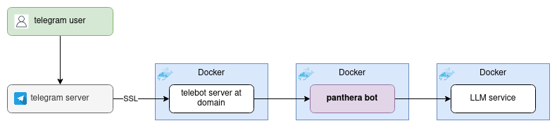

# panthera bot
Conversational telegram bot docker server  
  
* [Telebot server](https://github.com/format37/telegram_bot)  
* [Panthera bot](https://github.com/format37/pantherabot)  
* [LLM service](https://github.com/format37/openai_proxy)
# head and hands
Two containers. `panthera_gptaidbot` (the head) runs FastAPI and the Claude CLI
and holds every secret — the Telegram token, the API keys, `data/`, and the
Claude credentials. It gives the model **no built-in tools at all**: no Bash, no
Read, no Write. Everything the model can do is an in-process MCP tool defined in
`server/bot_tools.py`.

`panthera_sandbox` (the hands) runs whatever code the model writes, and holds
nothing: no secrets, no `data/`, no Claude config, and `network_mode: none` — it
has no network stack, so there is nowhere to send anything and nothing on the
host it can dial. The head reaches it over a Unix socket in `./run`, which is why
it needs no network. Per-chat scratch space lives in `./work/{chat_id}`; the head
mounts it read-only to view or deliver the files produced there.

Both directories are tracked with a `.gitkeep` so the checkout owns them. If they
are missing when compose starts, Docker creates them root-owned and the socket
cannot be created.

# root documents and photos mounting
":" are not suported in mouting therefore we need to remove user_id from mounting procedure:
```
sudo mount --bind "/user_id:token" "/mnt/token"
```
To provide mounting after reboot:
```
echo '"/user_id:TOKEN" /mnt/TOKEN none bind 0 0' | sudo tee -a /etc/fstab
```
# read access to the mounted files
The Telegram local server writes those files as root. Give uid 1000 (`appuser`
inside the container) read access with an ACL — the container itself holds no
capability and runs with `no-new-privileges`:
```
sudo setfacl -R  -m u:1000:rX /mnt/$BOT_TOKEN_WITHOUT_PREFIX
sudo setfacl -R -d -m u:1000:rX /mnt/$BOT_TOKEN_WITHOUT_PREFIX
```
The second line sets the *default* ACL so files created later inherit it. Verify
with a freshly sent photo — the bot must still describe it. If new files come out
unreadable anyway, `getfacl` one of them: a restrictive umask in telegram-bot-api
can zero the ACL mask, and the fallback is to restore `cap_add: DAC_READ_SEARCH`
plus the `setcap` lines in `server/Dockerfile`.

# the bot's Claude login
The bot has its own Claude config directory, `~/.claude-bot`, and never the host
user's `~/.claude`: anything under the mounted config dir is readable from any
chat through the Bash tool, and a `settings.json` there defines hooks. Create it
as the host user (not root) *before* the first `./compose.sh`, otherwise Docker
creates the mount point root-owned and the CLI cannot write to it:
```
mkdir -p ~/.claude-bot
CLAUDE_CONFIG_DIR=~/.claude-bot claude auth login    # prints a URL, paste the code back
CLAUDE_CONFIG_DIR=~/.claude-bot claude auth status
```
`docker-compose.yml` mounts it at `/home/appuser/.claude-bot` and sets
`CLAUDE_CONFIG_DIR` to match; credentials, `.claude.json` and session transcripts
all stay inside it.

Those transcripts hold every chat the bot has served, so prune them from the
host:
```
find ~/.claude-bot/projects -type f -mtime +7 -delete
```
`cleanupPeriodDays` in `~/.claude-bot/settings.json` will not do it: the bot's
queries run with `--setting-sources=`, so no settings file is loaded at all —
which is the point. A hook written into that file by a chat user must never run.
